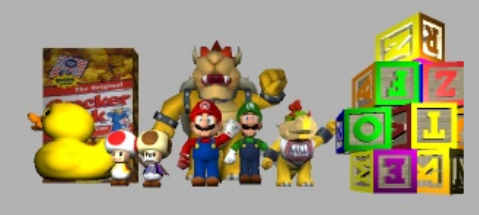
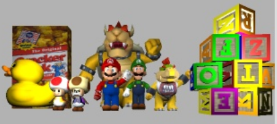
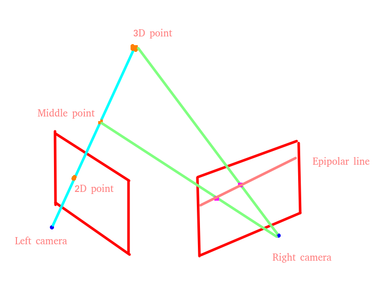
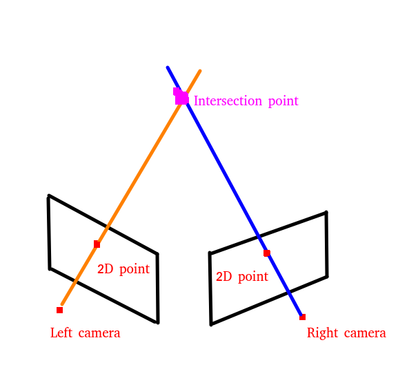
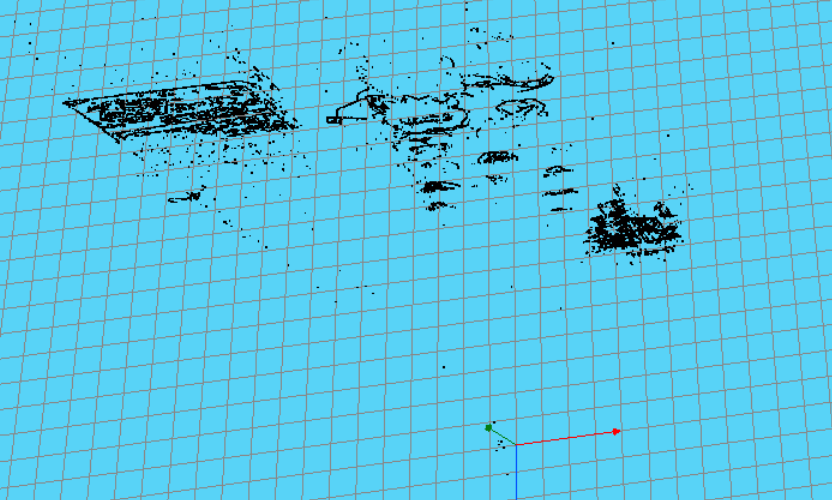
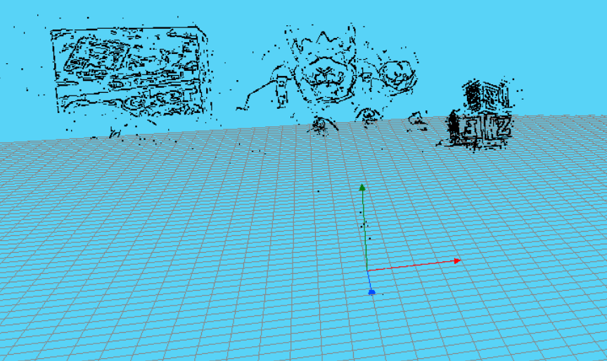
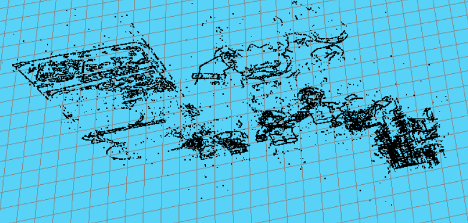
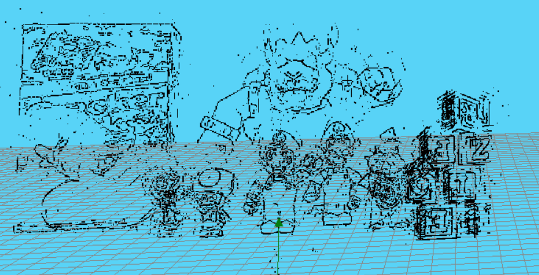
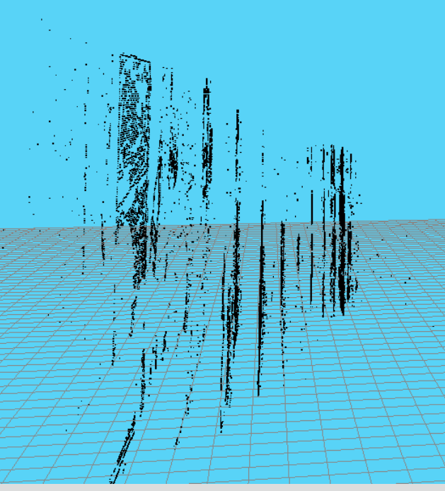

# 3D reconstruction exercise

## Index
+ [Post 1 - Introduction](#Introduction)
+ [Post 2 - First steps](#First_step)
+ [Post 3 - Epipolar fringe](#epipolar_fringe)
+ [Post 4 - Final results](#final_results)

## Post 1 - Introduction 
For this blog I am going to document the steps that I follow to accomplish the 3D reconstruction exercise at the Unibotics web page. This an exercise that try to reconstruct a 3D scene with a par stereo camera.

The first step is to get used to use the functions that the API provide us to do this task. The main functions are the following:

* GUI.showImages(imageLeft, imageRight, True) to show the images on the debug frame. 
* HAL.getImage('right') to get the left or right image
* HAL.graficToOptical(image, point2D) to convert the image coordinate system to camera coordinate system
* HAL.backproject(image, optical_point) to convert the camera coordinate system to 3D point 
* HAL.project(image, point) to convert the 3D point to the camera coordinate system
* HAL.opticalToGrafic(image, project_back) to convert the camera coordiante system to image coordinate system
* HAL.getCameraPosition('left') to get the cameras position in the 3D space 

Once we know what functions we can use it is time to program our 3D reconstruction algorithm, but first let's look at the type of images we are going to work with. The images are as follows: 

  

  

After analyzing the images, we have all to start programming our code. 

## Post 2 - First steps 

First of all, we have to know the main idea to reconstruct the 3D scene. To achieve that goal we have to know what points are important from one images to find his conterpart in the other. Then, when we have a point selected in the left image, for example, we must know where can be this point in the right image. For this task we must find the epipolar line. In a perfect world, this epipolar line would define where the point is, but there can be calibration erros in the camera, for that reason we have to define an epipolar fringe. 

Once we know the epipolar lines, it is time to use the square sum difference algorithm to find the best counterpart in the right image. 

Finally, with the two points in both images, we have to backproject this points to the 3D space, and with these lines we have to find where the lines intersect. 

The above steps describe the different tasks that we have to do to reconstruct the images into the 3D space. This steps are going to be explained in the next posts.

## Post 3 - Epipolar fringe 

In this post we are going to explain how to get the key points of one image and how to get the epipolar fringe in the other image. 

Getting the key points in one image is an easy task, because we only have to know what pixels contains relevant information to reconstruct the diferent shapes. To do this step we have used a Canny algorithm to know corners, edges... etc, and only evaluate the pixels that are not zero. 

Once we have one key pixel in the left image, we have to find his conterpart in the right image. There is not a direct representation of the pixel in the right image, so we have to know the back projection line in the 3D space and transfer some points to the right image. As we see in the introduction, there is a function that backproject the point into 3D space and a function that project the 3D point into an image. 

But in this case we only have one point, and a line is define by two points, so is important to find a second point. To achieve this task, we know the location of one point and the left camera position, so we can get the middle point of this line and we would have a second point. In the next image we can see a grafic explanation:

  

Now, we have two points into the right image that define the epipolar line, so using mathematics we can get the line ecuation using this formulas: 
* m = (y2 - y1) / (x2 - x1) to get the slope 
* y = (m * (x - x1)) + y1 to get the diferent points of the line 

With this formulas we can calculate the points of the line going through the x axis of the image. 

In this point, with all the points of the line it is time to evaluate what is the counterpart point of the left image, for this we have used the square sum difference to calculate how similar are the two regions. In this case, we have defined a 15x15 pixels size to get the diferent patches from the images. 

Moreover, as we said before, in a ideal world the counterpart point is in the epipolar line, but with de calibration erros, the best counterpart can be in the epipolar fringe. To get this epipolar fringe, what we have done is calculate the epipolar line for the projected points, and moving this points up and down in the y axis we can get two parallel lines from the original. 

After doing this, we should have the counterpart point, so we can have the backprojection of the canny point in the left image and the counterpart point backprojection in the right image.

## Post 4 - Final results 

Now we arrived to this post with the key points in the left image and right image. And we can backproject this points to get the 3D lines where the 3D point should be located. The 3D representation of this situation would be as follows: 

  

As we can see the lines should intersect in some point of the space, but this is not the common case, because the camera calibration errors. For this reason we have to calculate the point with minimum distance to both lines. 
Knowing the 3D backprojection points, and the camera positions, we are able to achieve this task.

After all those steps explained before, we have the 3D reconstruction in the web page visor. The final results can be seen in the next images:

These images are with the 50% progress of the algorithm completed:

  

  

These images are with the 100% progress of the algorithm completed:

  

  

  

## Conclusions

In conclusion, with this algorithm we can reconstruct the scene with a par stereo cameras and construct a point cloud that represents the real scene. Moreover, we can represent the real depth of the objects with just process the left and right images.
