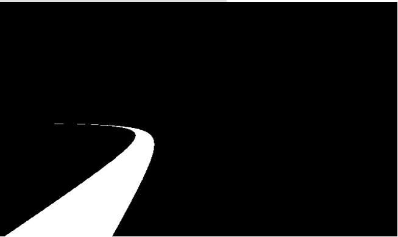
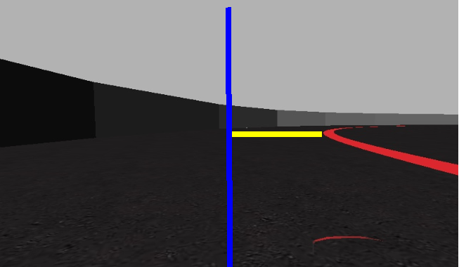

# Follow line exercise

## Index
+ [Post 13/03/2021 - Introduction](#ntroduction)
+ [Post 14/03/2021 - Proportional controller implemented](#Proportional_controller_implemented)
+ [Post 15/03/2021 - Derivative controller implemented](#Derivative_controller_implemented)
+ [Post 16/03/2021 - Integral controller implemented](#Integral_controller_implemented)
+ [Post 16/03/2021 - PD controller to control speed](#PD_controller_to_control_speed)

## Post 13/03/2021 - Introduction

This blog will document “the follow line” exercise from Unibotics.org web page for the master’s degree Artificial Vision. 
In this exercise the main goal is to follow a red line which is in the middle of the track and try to complete the lap in the shortest possible time. Less than 1 minute it’s a good time lap to accomplish it.

On this site there is an online editor to type our codes with two libraries to move the car and to get the different images from the simulator. The libraries provide different methods to control the car like:
* HAL.motors.sendV()
* HAL.motors.sendW()
* HAL.getImage()
* GUI.showImage()

Also it is important to know that the range of the speed is 0-5 and the range of the angular velocity is -0.5-0.5, being the negative numbers to turn right and the positive numbers to turn left. 

Knowing that the line is always red, our first approach to complete the exercise has been doing a color filter, getting a binary image where only the line is visible. The results that have been achieved are these:

  

With this approach the car can know where is the line and then the different states or actions that can be implemented based on the line location. The different states depend on the difference between the red line location and the middle of the image, so in this case the error will be measure in pixels units. In the next image, the yellow part of the image is the error.

  

With all these things in mind, we can start to implement the different actions that the car has to do based on the error that the color filter tell us. 

## Post 14/03/2021 - Proportional controller implemented

In the first post was explained how the line can be located, so now we are going to implement the first steps to move the car straight forward and try to turn right or left when the car came to a curve.

The first approach is going to be to implement a proportional controller for a constant speed, which is a good one, but it’s easy to correct too much the steering wheel angle in most situations. 
The formula of the proportional controller is: u = −Kp * e, being e the error, Kp a constant, which will be adjust by us based on the experience, and u the steering wheel angle that has to be apply. In this case, the error will measure how much the car have to increase or decrease the steering wheel angle to follow the line. 

Once the controller is implemented, we can see the results on the next video:

As we can see with the proportional controller the car can drive quite consistently, but sometimes, especially in changes of direction, the car is turning to one side bit it is not able to change the direction before crossing the line. 
For this reason, in the proportional controller the Kp constant is adjusted to 0.0015.

So based on the results, the car is already quite good but it is not driving over the line, because the proportional controller is not enough to correct the steering wheel angle completely.

## Post 15/03/2021 - Derivative controller implemented

With a proportional controller implemented, there are many ways to improve the car skills, and one of them is to implement a derivative controller, which allows the car to apply an extra correction of the steering wheel  if the error is increasing. On the opposite side, if the error is decreasing the derivative controller will reduce the amount of steering wheel angle that is applied. 

For this derivative controller the formula is: u = Kd * de/dt. With this formula the car is able to know if the error is increasing or decreasing over time. Obviously, this controller is an extra for the proportional controller, so the formula that mix both controllers is: u = Kp * e + Kd * de/dt.

Theoretically, the car will change the steering wheel angle more when the line is moving away and the car will change the steering wheel angle less when the line is approaching. This controller should improve the car skills at the corners entry, because the line will be moving away and both controllers, proportional and derivative, will apply steering wheel angle in the same direction. On the other hand, at corners exit the error will be decreasing, so the derivative controller will apply the correction in the opposite direction than the proportional controller. 

With this controller implemented, the results are the following: 

In the video, we can see how the derivative controller works at the exit of the first corner, because the derivative controller applies force in the opposite direction than the proportional controller and the car does not cross the red line unlike the proportional controller video. 

For this case, the Kd  constant is adjusted to 0.0020 and the car is moving straight forward at the same speed every time. 

In conclusion, with this modification the car drive a little better but it is not enough to drive over the red line because when the error is the same in each iteration, the derivative controller does not apply any force in any direction. 

## Post 16/03/2021 - Integral controller implemented

In the post before a derivative controller was implemented, but we saw that it was not enough to drive over the red line, so in this step an integral controller is going to be implemented. 

An integral controller will provide the car an extra variable to correct the steering wheel angle, this controller see how much time the car is having error regarding the red line. So, for example, if the car is having error for 3 iterations the integral controller will apply correction in the error direction, and it will increase the correction in every iteration that has error. 
For this controller the formula is: u = Ki  *  , being the integral of the time that the car has error regarding the red line. 
In the next video the improvement of the car can be seen: 

In the video is easy to see how the integral controller can apply more correction of the steering wheel when the car is not driving over the red line, sometimes the car even cross the line, because the car takes a long time with error and the integral controller is applying too much correction. 

For this controller the Ki constant is adjusted to 0.010. 

In conclusion with a PID controller implemented and constant speed, the car is able to finish the lap in 0:52 secs, which improves the proportional controller lap in one second. Obviously, it is not too much improvement, but in all these experiments the speed had been constant, so the improvements are just related to how the car is driving over the red line. 

## Post 16/03/2021 - PD controller to control speed

After implement a PID controller to control the angular velocity, the car is able to follow the line and finish the track on 0:52 secs, but the speed was always the same, so depending on if the car is on a straight section or a corner, the speed could be different. 

For that reason, a PD controller has been implemented to control the speed of the car. In this case the action is the inverse of the angular velocity, so if the line is on the middle of the image the error would be 0 and the speed has to be maximum. 

The principles of this PD controller are the same as the PID controller for the angular velocity, adjusting the Kp to 0.011 and the Kd  to 0.020. The final formula to control the speed would be: u = Kp * e + Kd * de/dt

As it can be seen in the video, controlling the speed the car can finish the lap in 0:38 secs, which is a good lap time improvement. Although it is a good time, we can see that the car is not perfect yet. It could be because the constants of the PID controllers can be adjusted better, therefore this are going to do in the next post. 